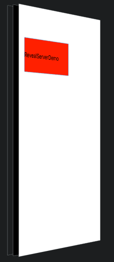

# RevealServerDemo
RevealServerDemo 简单配置Demo
Reveal 配置网上有很多配置方法，比如这个：https://www.cnblogs.com/somethingWithiOS/p/6594496.html，
配置比较麻烦，需要更改工程文件，这里介绍一个简单的方法。

 pod配置方法，一行即可，不用修改工程文件:

 
```
   pod 'RevealServer',  :configurations => ['Debug'],  :path => './RevealServer'
```
 
:configurations 意思是只有在debug下有效
        
        
        
RevealServer.podspec 内容如下
        
 ```ruby
        
  Pod::Spec.new do |s|

  s.name         = "RevealServer"
  s.version      = "15.3.3"
  s.summary      = "RevealServer sdk"

  s.description  = <<-DESC
                    RevealServer
                   DESC
  s.homepage     = "http://www.baidu.com"
  s.license      = "MIT"
  s.author             = { "zzz 2019-1-5" => "" }
  s.platform     = :ios, "7.0"  
  s.ios.deployment_target = "7.0"
  s.source       = { :git => "http://www.baidu.com" }
  s.source_files  = "RevealServer.framework/**/*.h"
  s.vendored_frameworks = 'RevealServer.framework'

end
   
 ```
 
 


